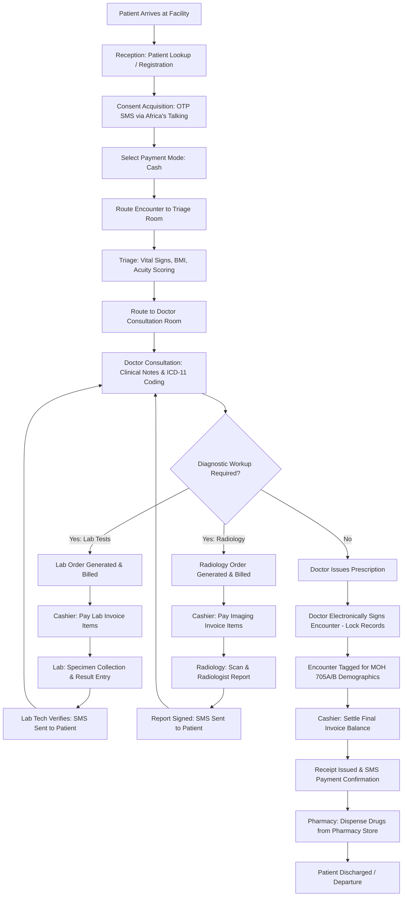
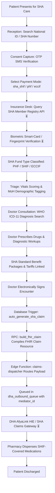
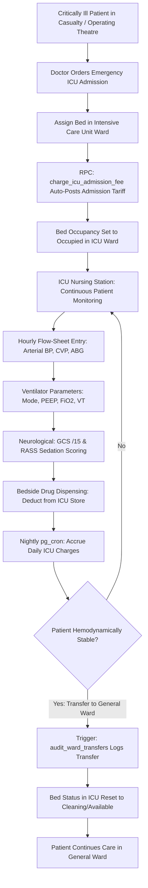
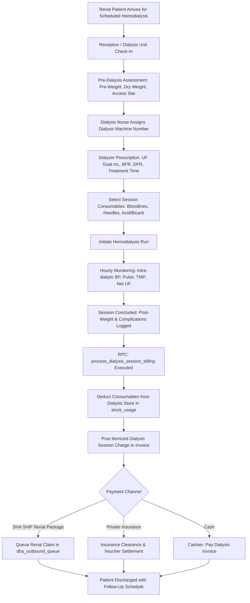
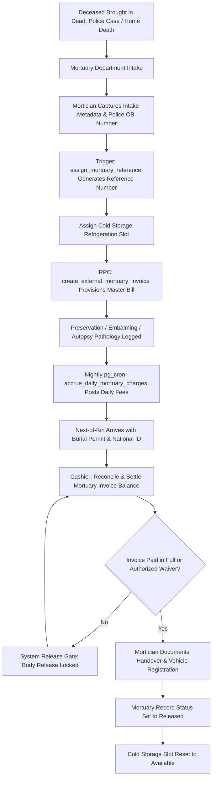

# AegisCare HMS — Database Schema & System Architecture

**Document Title:** Database Schema Specification & System Topology  
**Document Version:** 1.0.0  
**Database Engine:** PostgreSQL 15+ (Supabase Managed with RLS)  
**Target Environment:** Kenya MoH Level 1–6 Facilities  

---

## Section 1 — Entity Relationship Diagram (Mermaid ERD)

```mermaid
erDiagram
    %% ==========================================
    %% PATIENT CORE & ADMISSIONS
    %% ==========================================
    PATIENTS ||--o{ ENCOUNTERS : "has"
    PATIENTS ||--o{ PATIENT_CONSENTS : "grants"
    PATIENTS ||--o{ CONSENT_OTPS : "receives"
    PATIENTS ||--o{ APPOINTMENTS : "books"
    PATIENTS ||--o{ ADMISSIONS : "undergoes"
    PATIENTS ||--o{ INVOICES : "billed"
    PATIENTS ||--o{ MORTUARY_RECORDS : "admitted_postmortem"

    WARDS ||--o{ BEDS : "contains"
    WARDS ||--o{ ADMISSIONS : "hosts"
    BEDS ||--o{ ADMISSIONS : "occupies"
    ENCOUNTERS ||--o{ ADMISSIONS : "triggers"

    %% ==========================================
    %% CLINICAL & DIAGNOSTICS
    %% ==========================================
    ENCOUNTERS ||--o{ CLINICAL_NOTES : "documents"
    ENCOUNTERS ||--o{ ENCOUNTER_DIAGNOSES : "coded_with"
    ENCOUNTERS ||--o{ LAB_ORDERS : "orders"
    ENCOUNTERS ||--o{ RADIOLOGY_ORDERS : "orders"
    ENCOUNTERS ||--o{ PRESCRIPTIONS : "prescribes"
    ENCOUNTERS ||--o{ ENCOUNTER_ROOM_VISITS : "routes"
    ENCOUNTERS ||--o{ ENCOUNTER_INDICATOR_TAGS : "tagged"

    LAB_ORDERS ||--o{ LAB_RESULTS : "yields"
    LAB_TEST_CATALOG ||--o{ LAB_ORDERS : "defines"
    RADIOLOGY_ORDERS ||--o{ RADIOLOGY_RESULTS : "yields"
    ADMISSIONS ||--o{ MEDICATION_ADMINISTRATIONS : "administers"
    PRESCRIPTIONS ||--o{ MEDICATION_ADMINISTRATIONS : "schedules"

    %% ==========================================
    %% SPECIALIZED UNITS (ICU & DIALYSIS)
    %% ==========================================
    ADMISSIONS ||--o{ ICU_HOURLY_CHARTS : "tracks_hourly"
    ENCOUNTERS ||--o{ DIALYSIS_SESSIONS : "conducts"
    MACHINES ||--o{ DIALYSIS_SESSIONS : "operates_on"
    MACHINES ||--o{ MACHINE_LOGS : "logs_service"

    %% ==========================================
    %% STOCK & PHARMACY
    %% ==========================================
    STOCK_LOCATIONS ||--o{ STOCK_MOVEMENTS : "stores"
    STOCK_LOCATIONS ||--o{ STOCK_TRANSFERS : "transfers_from_or_to"
    STOCK_LOCATIONS ||--o{ STOCK_USAGE : "consumes_from"
    STOCK_ITEMS ||--o{ STOCK_MOVEMENTS : "adjusts"
    STOCK_ITEMS ||--o{ STOCK_TRANSFERS : "transferred"
    STOCK_ITEMS ||--o{ STOCK_USAGE : "used"
    STOCK_ITEMS ||--o{ PRESCRIPTIONS : "fulfills"

    %% ==========================================
    %% BILLING & INVOICING
    %% ==========================================
    ENCOUNTERS ||--o{ INVOICES : "provisions"
    INVOICES ||--o{ INVOICE_LINE_ITEMS : "contains"
    INVOICES ||--o{ INVOICE_PAYMENTS : "settled_by"
    MORTUARY_RECORDS ||--o{ INVOICES : "billed_via"

    %% ==========================================
    %% INSURANCE, SHA & HIE INTEROPERABILITY
    %% ==========================================
    INSURANCE_PROVIDERS ||--o{ INSURANCE_BENEFIT_PLANS : "offers"
    INSURANCE_PROVIDERS ||--o{ CONTRACTED_PRICES : "negotiates"
    INSURANCE_BENEFIT_PLANS ||--o{ INSURANCE_BENEFIT_CATEGORIES : "defines_benefits"
    ENCOUNTERS ||--o{ SHA_CLAIMS : "generates_claim"
    SHA_CLAIMS ||--o{ SHA_CLAIM_ITEMS : "itemizes"
    ENCOUNTERS ||--o{ DHA_OUTBOUND_QUEUE : "queues_sync"
    ENCOUNTERS ||--o{ EPISODE_OF_CARE : "grouped_by"

    %% ==========================================
    %% AUTH, ROLES & ROOMS
    %% ==========================================
    PROFILES ||--o{ USER_ROLES : "assigned"
    ROOMS ||--o{ ENCOUNTER_ROOM_VISITS : "visited"
    ROOMS ||--o{ USER_ROOM_ACCESS : "grants_access"
    ROOMS ||--o{ STOCK_LOCATIONS : "houses_inventory"

    %% ==========================================
    %% ENTITY DEFINITIONS & ATTRIBUTES
    %% ==========================================
    PATIENTS {
        uuid id PK
        string file_number UK
        string first_name
        string family_name
        string national_id
        date date_of_birth
        boolean dob_known
        string sex
        string phone
        string county
        jsonb next_of_kin
        boolean is_deceased
        timestamp created_at
    }

    ENCOUNTERS {
        uuid id PK
        uuid patient_id FK
        string encounter_type
        string payment_mode
        uuid insurance_provider_id FK
        string insurance_policy_number
        string status
        boolean is_emergency
        jsonb vitals
        uuid current_room_id FK
        timestamp created_at
        timestamp updated_at
    }

    ADMISSIONS {
        uuid id PK
        uuid encounter_id FK
        uuid patient_id FK
        uuid ward_id FK
        uuid bed_id FK
        string status
        timestamp admitted_at
        timestamp discharged_at
        text discharge_summary
        string admitting_doctor
    }

    WARDS {
        uuid id PK
        string name
        string ward_type
        numeric daily_rate
        integer capacity
        boolean is_active
    }

    BEDS {
        uuid id PK
        uuid ward_id FK
        string bed_number
        string status
    }

    CLINICAL_NOTES {
        uuid id PK
        uuid encounter_id FK
        uuid admission_id FK
        string note_type
        text content
        uuid authored_by FK
        timestamp authored_at
    }

    ENCOUNTER_DIAGNOSES {
        uuid id PK
        uuid encounter_id FK
        string icd11_code
        string icd11_title
        string icd11_uri
        string diagnosis_type
        integer sequence
    }

    LAB_ORDERS {
        uuid id PK
        uuid encounter_id FK
        uuid patient_id FK
        uuid catalog_id FK
        string priority
        string status
        uuid ordered_by FK
        timestamp ordered_at
    }

    LAB_RESULTS {
        uuid id PK
        uuid order_id FK
        jsonb result_data
        string qualitative_result
        string interpretation
        string status
        uuid verified_by FK
        timestamp verified_at
    }

    RADIOLOGY_ORDERS {
        uuid id PK
        uuid encounter_id FK
        uuid patient_id FK
        string modality
        string anatomical_site
        string priority
        string status
    }

    RADIOLOGY_RESULTS {
        uuid id PK
        uuid order_id FK
        text findings
        text impression
        string radiologist
        jsonb image_paths
        timestamp reported_at
    }

    PRESCRIPTIONS {
        uuid id PK
        uuid encounter_id FK
        uuid stock_item_id FK
        string drug_name
        string dosage
        string frequency
        string duration
        numeric quantity
        string status
        uuid dispensed_by FK
        timestamp dispensed_at
    }

    MEDICATION_ADMINISTRATIONS {
        uuid id PK
        uuid admission_id FK
        uuid prescription_id FK
        string drug_name
        string dose_given
        string route
        uuid administered_by FK
        timestamp administered_at
    }

    ICU_HOURLY_CHARTS {
        uuid id PK
        uuid admission_id FK
        integer hour_number
        numeric arterial_bp_systolic
        numeric arterial_bp_diastolic
        numeric cvp
        integer gcs_total
        integer rass_score
        numeric peep
        numeric fio2_percent
        numeric urine_output_ml
        jsonb inotropes
        uuid logged_by FK
        timestamp recorded_at
    }

    DIALYSIS_SESSIONS {
        uuid id PK
        uuid encounter_id FK
        uuid patient_id FK
        uuid machine_id FK
        numeric pre_weight_kg
        numeric post_weight_kg
        numeric uf_goal_ml
        numeric uf_achieved_ml
        numeric blood_flow_rate
        numeric dialysate_flow_rate
        string dialyzer_model
        string access_type
        jsonb complications
        string status
        timestamp session_start
        timestamp session_end
    }

    MORTUARY_RECORDS {
        uuid id PK
        string mortuary_reference UK
        string body_source
        string deceased_name
        string gender
        date date_of_death
        string storage_slot
        string brought_in_by_name
        string police_ob_number
        uuid released_to_national_id
        timestamp admitted_at
        timestamp released_at
    }

    STOCK_ITEMS {
        uuid id PK
        string name
        string category
        string unit
        numeric current_quantity
        numeric reorder_level
        numeric unit_price
        numeric cash_price
        numeric insurance_price
    }

    STOCK_LOCATIONS {
        uuid id PK
        string name
        string code UK
        uuid room_id FK
        boolean is_active
    }

    STOCK_MOVEMENTS {
        uuid id PK
        uuid item_id FK
        numeric change
        string reason
        string notes
        uuid created_by FK
        timestamp created_at
    }

    STOCK_TRANSFERS {
        uuid id PK
        uuid item_id FK
        uuid from_location_id FK
        uuid to_location_id FK
        numeric quantity
        string status
        uuid initiated_by FK
    }

    STOCK_USAGE {
        uuid id PK
        uuid encounter_id FK
        uuid item_id FK
        uuid location_id FK
        numeric used_quantity
        string usage_reason
        timestamp used_at
    }

    INVOICES {
        uuid id PK
        string invoice_number UK
        uuid encounter_id FK
        uuid patient_id FK
        numeric subtotal
        numeric discount
        numeric waiver_amount
        numeric amount_paid
        numeric balance
        string status
        timestamp created_at
    }

    INVOICE_LINE_ITEMS {
        uuid id PK
        uuid invoice_id FK
        uuid encounter_id FK
        string item_type
        uuid source_id
        string description
        numeric quantity
        numeric unit_price
        numeric amount
    }

    INVOICE_PAYMENTS {
        uuid id PK
        uuid invoice_id FK
        numeric amount
        string method
        string reference
        uuid received_by FK
        timestamp paid_at
    }

    INSURANCE_PROVIDERS {
        uuid id PK
        string name
        string code UK
        numeric coverage_percentage
        boolean is_active
    }

    INSURANCE_BENEFIT_PLANS {
        uuid id PK
        uuid provider_id FK
        string plan_name
        string plan_code
        numeric copay_amount
        integer visit_limit
    }

    SHA_CLAIMS {
        uuid id PK
        uuid encounter_id FK
        uuid patient_id FK
        string claim_type
        string fund_type
        string preauth_code
        numeric claim_amount
        string status
        jsonb fhir_bundle
        timestamp submitted_at
    }

    SHA_CLAIM_ITEMS {
        uuid id PK
        uuid claim_id FK
        string tariff_code
        string item_description
        numeric unit_price
        numeric claimed_amount
    }

    DHA_OUTBOUND_QUEUE {
        uuid id PK
        uuid encounter_id FK
        uuid patient_id FK
        string queue_type
        string insurer_type
        jsonb payload
        string status
        integer attempts
        timestamp created_at
    }

    PROFILES {
        uuid id PK
        string full_name
        string council_type
        string council_registration_number
        string phone
        string national_id
        boolean is_approved
    }

    USER_ROLES {
        uuid id PK
        uuid user_id FK
        string role
    }

    ROLE_PERMISSIONS {
        string role PK
        string permission PK
    }

    ROOMS {
        uuid id PK
        string name
        string code
        string kind
        boolean is_active
    }

    MACHINES {
        uuid id PK
        string name
        string model
        string serial_number
        string status
        string location
    }

    MACHINE_LOGS {
        uuid id PK
        uuid machine_id FK
        string log_type
        date log_date
        string description
        numeric cost
    }

    APP_SETTINGS {
        string id PK
        string facility_name
        string facility_kmhfl_code
        string facility_sha_id
        integer facility_level
        string county
    }

    AUDIT_LOG {
        uuid id PK
        string table_name
        uuid record_id
        string action
        jsonb old_data
        jsonb new_data
        uuid changed_by FK
        timestamp changed_at
    }
```

---

## Section 2 — Patient Journey Flows (Mermaid Flowcharts)

---

### Flow 1: Cash Outpatient Journey

---

### Flow 2: Insurance Inpatient Journey

```mermaid
flowchart TD
    A[Patient Arrives with Private / Corporate Insurance] --> B[Reception: Register & Link Underwriter Policy]
    B --> C[Consent Verification: OTP SMS]
    C --> D[Route to Insurance Desk]
    D --> E[Insurance Agent: Verify Eligibility & Pre-Authorization]
    E --> F[Contracted Tariffs Applied to Encounter]
    F --> G[Triage: Baseline Vitals Capture]
    G --> H[Doctor Consultation: Examination & Diagnosis]
    H --> I[Doctor Orders Inpatient Ward Admission]
    
    I --> J[Assign Inpatient Ward & Specific Bed]
    J --> K[Bed Status Set to Occupied]
    K --> L[Ward Nursing Care: Medication Administrations MAR]
    L --> M[Nightly pg_cron Daemon: Accrue Daily Bed Charges]
    
    M --> N{Patient Clinically Ready for Discharge?}
    N -- No --> L
    N -- Yes --> O[Doctor Completes Mandatory Discharge Summary]
    O --> P[Doctor Signs Admission File]
    P --> Q[Pharmacy: Reconcile & Dispense Discharge Medications]
    Q --> R[Billing: Compile Itemized Interim Inpatient Bill]
    R --> S[Insurance Desk: Submit Electronic Claim / Guarantee]
    S --> T[Underwriter Approval Received / Copay Paid]
    T --> U[Discharge Clearance Granted & Bed Set to Available]
    U --> V[Patient Discharged Home]
```

---

### Flow 3: SHA SHIF Journey (Including Biometric Step)

---

### Flow 4: ICU Admission Journey

---

### Flow 5: Dialysis Session Journey

---

### Flow 6: Mortuary (External Body) Journey

---

## Section 3 — System Architecture Diagram (Mermaid)

```mermaid
flowchart TB
    subgraph CLIENT_LAYER ["Frontend Client Tier (Browser)"]
        UI["React 18 Single-Page Application"]
        ROUTER["TanStack Router (Type-Safe Routing)"]
        QUERY["TanStack Query (Optimistic State & Cache)"]
        SHADCN["Tailwind CSS + Shadcn UI Component Suite"]
        UI --- ROUTER --- QUERY --- SHADCN
    end

    subgraph HOSTING_EDGE ["Hosting & CDN Tier"]
        VERCEL["Vercel Edge Network / Lovable Cloud"]
        BUN["Bun Runtime & Build Tooling"]
        VERCEL --- BUN
    end

    subgraph SUPABASE_BACKEND ["Supabase Cloud Platform"]
        AUTH["Supabase Auth (JWT, Role Mapping)"]
        REALTIME["Supabase Realtime (WebSocket Queues & Beds)"]
        
        subgraph POSTGRES_DB ["PostgreSQL 15 Database Engine"]
            TABLES["35+ Relational Relational Tables"]
            RLS["Row-Level Security (RLS) Policies"]
            TRIGGERS["PL/pgSQL Business Triggers & Rules"]
            CRON["pg_cron Background Scheduling Daemons"]
            AUDIT["Append-Only Audit Logging & Archive"]
            TABLES --- RLS --- TRIGGERS --- CRON --- AUDIT
        end

        subgraph EDGE_FUNCTIONS ["Supabase Deno Edge Functions"]
            SMS_FN["send-sms (Africa's Talking Gateway)"]
            ICD_FN["icd11-search (WHO Cloud Proxy)"]
            DISPATCH_FN["claims-dispatcher (HIE & Claims Router)"]
            FHIR_PAT["fhir-patient (R4 Resource Builder)"]
            FHIR_ENC["fhir-encounter (R4 Resource Builder)"]
            FHIR_COND["fhir-condition (R4 Resource Builder)"]
            FHIR_BND["fhir-bundle (R4 Collection Builder)"]
        end
    end

    subgraph EXTERNAL_INTEGRATIONS ["External Gateways & Regulators"]
        AT_SMS["Africa's Talking SMS API (Production ✅)"]
        WHO_API["WHO ICD-11 MMS Cloud API (Production ✅)"]
        DHA_HIE["Kenya DHA AfyaLink HIE (Pending Credentials ⏳)"]
        SHA_GATEWAY["SHA SHIF / PHF / ECCIF Claims (Pending ⏳)"]
        MPESA["Safaricom M-Pesa Daraja Gateway (Planned 📋)"]
    end

    UI -->|HTTPS / REST & GraphQL| POSTGRES_DB
    UI -->|WSS Realtime Feeds| REALTIME
    UI -->|JWT Auth Handshake| AUTH
    UI -->|Edge Invocations| EDGE_FUNCTIONS

    SMS_FN -->|HTTPS REST| AT_SMS
    ICD_FN -->|OAuth2 / REST| WHO_API
    DISPATCH_FN -->|FHIR R4 REST| DHA_HIE
    DISPATCH_FN -->|FHIR Claim REST| SHA_GATEWAY
    POSTGRES_DB -.->|Nightly Cron Execution| CRON
```

---

## Section 4 — Table Descriptions & Security Schema

---

### 1. `patients`
- **Purpose:** Master Patient Index (MPI) repository storing demographic identity, contact details, next-of-kin, and vital status.
- **Key Columns:** `id` (UUID PK), `file_number` (Unique Text, e.g., `P000142`), `first_name`, `middle_name`, `family_name`, `patient_name`, `national_id`, `date_of_birth`, `dob_known` (Boolean), `estimated_age`, `sex` (`male`/`female`), `phone`, `email`, `county`, `next_of_kin` (JSONB), `is_deceased` (Boolean).
- **Relationships:** One-to-many with `encounters`, `admissions`, `invoices`, `appointments`, `patient_consents`, `consent_otps`.
- **RLS Policy Summary:**
  - `SELECT`: Permitted for all authenticated and approved hospital staff (`is_approved(auth.uid())`).
  - `INSERT` / `UPDATE`: Restricted to users possessing `register_patient`, `records_create`, or `admin` permissions.
  - `DELETE`: Explicitly prohibited (`USING (false)`).

---

### 2. `encounters` (Aliased as `patient_registrations`)
- **Purpose:** Central operational table tracking patient episodes spanning OPD registration, triage vitals, consultation, and discharge.
- **Key Columns:** `id` (UUID PK), `patient_id` (FK `patients.id`), `encounter_type` (`outpatient`, `inpatient`, `emergency`), `payment_mode` (`cash`, `insurance`, `sha_shif`, `exemption`), `insurance_provider_id` (FK `insurance_providers.id`), `insurance_policy_number`, `status` (`waiting`, `in_progress`, `done`, `signed`, `cancelled`), `is_emergency` (Boolean), `vitals` (JSONB), `current_room_id` (FK `rooms.id`), `subtotal`, `amount_paid`, `created_at`, `updated_at`.
- **Relationships:** Belongs to `patients`; Has many `clinical_notes`, `encounter_diagnoses`, `lab_orders`, `radiology_orders`, `prescriptions`, `invoices`, `admissions`, `sha_claims`.
- **RLS Policy Summary:**
  - `SELECT`: Permitted for approved staff.
  - `INSERT`: Permitted for reception, triage, and clinical staff.
  - `UPDATE`: Permitted for attending clinicians and room staff; mutations strictly blocked once `status = 'signed'` via `enforce_encounter_lock` trigger.

---

### 3. `admissions`
- **Purpose:** Tracks inpatient hospitalizations from bed allocation through clinical ward care to discharge summary.
- **Key Columns:** `id` (UUID PK), `encounter_id` (FK `encounters.id`), `patient_id` (FK `patients.id`), `ward_id` (FK `wards.id`), `bed_id` (FK `beds.id`), `admitted_at`, `discharged_at`, `admitting_doctor`, `admission_reason`, `admission_type`, `status` (`admitted`, `discharged`, `transferred`), `discharge_summary` (Text).
- **Relationships:** Belongs to `encounters`, `patients`, `wards`, `beds`; Has many `icu_hourly_charts`, `medication_administrations`.
- **RLS Policy Summary:**
  - `SELECT`: Approved staff.
  - `INSERT` / `UPDATE`: Restricted to clinical staff (`doctor`, `clinical_officer`, `nurse`, `admin`). Discharge requires non-null `discharge_summary`.

---

### 4. `wards` & `beds`
- **Purpose:** Physical inpatient infrastructure management, tracking bed capacities, occupancy states, and daily ward rates.
- **Key Columns:** 
  - `wards`: `id` (UUID PK), `name`, `ward_type` (`general`, `maternity`, `pediatric`, `surgical`, `icu`, `hdu`), `daily_rate` (Numeric), `capacity` (Integer), `is_active` (Boolean).
  - `beds`: `id` (UUID PK), `ward_id` (FK `wards.id`), `bed_number` (Text), `status` (`available`, `occupied`, `maintenance`, `cleaning`).
- **Relationships:** `wards` has many `beds` and `admissions`. `beds` belongs to `wards`.
- **RLS Policy Summary:**
  - `SELECT`: Approved staff.
  - `INSERT` / `UPDATE` / `DELETE`: Restricted to `admin` role.

---

### 5. `clinical_notes`
- **Purpose:** Structured clinical documentation entered by attending doctors and clinical officers.
- **Key Columns:** `id` (UUID PK), `encounter_id` (FK `encounters.id`), `admission_id` (FK `admissions.id`), `note_type` (`chief_complaint`, `hpi`, `ros`, `examination`, `plan`, `progress_note`), `content` (Text), `authored_by` (FK `auth.users`), `authored_at`.
- **Relationships:** Belongs to `encounters`, `admissions`.
- **RLS Policy Summary:**
  - `SELECT`: Approved medical and nursing staff.
  - `INSERT`: Attending clinicians. Updates locked once parent encounter is signed.

---

### 6. `encounter_diagnoses`
- **Purpose:** International diagnostic disease codes linked to encounters, mapped to WHO ICD-11 MMS terminology.
- **Key Columns:** `id` (UUID PK), `encounter_id` (FK `encounters.id`), `icd11_code` (Varchar), `icd11_title` (Text), `icd11_uri` (Text), `diagnosis_type` (`primary`, `secondary`, `working`, `differential`), `sequence` (Integer), `notes` (Text).
- **Relationships:** Belongs to `encounters`.
- **RLS Policy Summary:**
  - `SELECT`: Approved clinical staff.
  - `INSERT` / `UPDATE`: Attending clinicians. Protected by `clean_and_validate_diagnosis_insert()` and locked upon encounter signing.

---

### 7. `lab_orders` & `lab_results`
- **Purpose:** Laboratory diagnostic requisitions, analyzer result records, reference range validation, and technologist verification.
- **Key Columns:**
  - `lab_orders`: `id` (UUID PK), `encounter_id`, `patient_id`, `catalog_id` (FK `lab_test_catalog.id`), `priority` (`routine`, `urgent`), `status` (`ordered`, `in_progress`, `completed`, `cancelled`), `ordered_by`.
  - `lab_results`: `id` (UUID PK), `order_id` (FK `lab_orders.id`), `result_data` (JSONB), `qualitative_result` (Text), `interpretation` (Text), `status` (`draft`, `verified`), `verified_by` (FK `auth.users`), `verified_at`.
- **Relationships:** `lab_orders` belongs to `encounters`; has one `lab_results`.
- **RLS Policy Summary:**
  - `lab_orders`: Clinicians insert; Lab techs update status.
  - `lab_results`: `lab_tech` role has exclusive insert/update rights. Verified results are immutable.

---

### 8. `radiology_orders` & `radiology_results`
- **Purpose:** Medical imaging workflow management from clinician requisition to radiologist diagnostic report.
- **Key Columns:**
  - `radiology_orders`: `id` (UUID PK), `encounter_id`, `patient_id`, `modality` (`xray`, `ultrasound`, `ct`, `mri`, `ecg`), `anatomical_site`, `priority`, `status`, `clinical_indication`.
  - `radiology_results`: `id` (UUID PK), `order_id` (FK `radiology_orders.id`), `findings` (Text), `impression` (Text), `radiologist` (Text), `image_paths` (JSONB), `reported_at`.
- **Relationships:** `radiology_orders` belongs to `encounters`; has one `radiology_results`.
- **RLS Policy Summary:**
  - `radiology_orders`: Clinicians insert; Radiologists update.
  - `radiology_results`: Restricted to `radiologist` and `doctor` roles.

---

### 9. `prescriptions` & `medication_administrations`
- **Purpose:** Clinical pharmaceutical orders, pharmacy dispensing validations, and inpatient bedside nursing administration (MAR).
- **Key Columns:**
  - `prescriptions`: `id` (UUID PK), `encounter_id` (or `registration_id`), `stock_item_id` (FK `stock_items.id`), `drug_name`, `dosage`, `frequency`, `duration`, `quantity`, `status` (`pending`, `dispensed`, `cancelled`), `dispensed_by`, `dispensed_at`.
  - `medication_administrations`: `id` (UUID PK), `admission_id`, `prescription_id`, `drug_name`, `dose_given`, `route`, `administered_by`, `administered_at`.
- **Relationships:** `prescriptions` belongs to `encounters`, `stock_items`; has many `medication_administrations`.
- **RLS Policy Summary:**
  - `prescriptions`: Clinicians create; `pharmacist` updates to `dispensed` (triggering stock decrement).
  - `medication_administrations`: Restricted to `nurse` and `doctor` roles.

---

### 10. `icu_hourly_charts`
- **Purpose:** High-frequency critical care monitoring records for ICU inpatients.
- **Key Columns:** `id` (UUID PK), `admission_id` (FK `admissions.id`), `hour_number` (Integer), `arterial_bp_systolic`, `arterial_bp_diastolic`, `cvp`, `gcs_total` (3–15), `rass_score` (-5 to +4), `peep`, `fio2_percent`, `urine_output_ml`, `inotropes` (JSONB), `logged_by`, `recorded_at`.
- **Relationships:** Belongs to `admissions`.
- **RLS Policy Summary:**
  - `SELECT`: Approved ICU clinical staff.
  - `INSERT` / `UPDATE`: Restricted to `nurse`, `doctor`, and `admin` roles in ICU room.

---

### 11. `dialysis_sessions`
- **Purpose:** Clinical flow-sheet for hemodialysis treatments and automated consumable billing.
- **Key Columns:** `id` (UUID PK), `encounter_id`, `patient_id`, `machine_id` (FK `machines.id`), `pre_weight_kg`, `post_weight_kg`, `uf_goal_ml`, `uf_achieved_ml`, `blood_flow_rate`, `dialysate_flow_rate`, `dialyzer_model`, `access_type`, `complications` (JSONB), `status`, `session_start`, `session_end`.
- **Relationships:** Belongs to `encounters`, `patients`, `machines`.
- **RLS Policy Summary:**
  - Restricted to `nurse`, `doctor`, and `admin` assigned to the Dialysis Unit.

---

### 12. `mortuary_records`
- **Purpose:** Administrative tracking of deceased bodies admitted internally or externally.
- **Key Columns:** `id` (UUID PK), `mortuary_reference` (Unique Text, e.g., `MORT-2026-0012`), `body_source` (`internal`, `external`), `deceased_name`, `gender`, `date_of_death`, `storage_slot`, `brought_in_by_name`, `police_ob_number`, `released_to_national_id`, `admitted_at`, `released_at`.
- **Relationships:** Has one linked `invoices` record.
- **RLS Policy Summary:**
  - Restricted to `mortician`, `accountant`, and `admin` roles. Body release blocked if invoice has an unpaid balance.

---

### 13. `stock_items`, `stock_locations`, `stock_movements`, `stock_transfers`, `stock_usage`
- **Purpose:** Real-time multi-location perpetual inventory management across Main Warehouse, Pharmacy, ICU, and Dialysis stores.
- **Key Columns:**
  - `stock_items`: `id` (UUID PK), `name`, `category`, `unit`, `current_quantity`, `reorder_level`, `unit_price`, `cash_price`, `insurance_price`.
  - `stock_locations`: `id` (UUID PK), `name`, `code` (Unique), `room_id` (FK `rooms.id`), `is_active`.
  - `stock_movements`: `id` (UUID PK), `item_id`, `change` (Numeric), `reason` (`delivery`, `dispense`, `transfer_in`, `transfer_out`, `usage`, `adjustment`), `notes`, `created_by`, `created_at`.
  - `stock_transfers`: `id` (UUID PK), `item_id`, `from_location_id`, `to_location_id`, `quantity`, `status`.
  - `stock_usage`: `id` (UUID PK), `encounter_id`, `item_id`, `location_id`, `used_quantity`, `usage_reason`.
- **Relationships:** `stock_items` has many movements, transfers, and usage records.
- **RLS Policy Summary:**
  - Read: Approved staff.
  - Mutations: Governed by `user_stock_location_access` matrix and executed via secure RPCs (`apply_stock_movement` trigger).

---

### 14. `invoices`, `invoice_line_items`, `invoice_payments`
- **Purpose:** Master fiscal ledger maintaining real-time itemized billing, payments, waivers, and aging.
- **Key Columns:**
  - `invoices`: `id` (UUID PK), `invoice_number` (Unique Text, e.g., `INV-2026-00891`), `encounter_id`, `patient_id`, `subtotal`, `discount`, `waiver_amount`, `amount_paid`, `balance`, `status` (`draft`, `pending`, `partial`, `paid`, `waived`, `claimed`).
  - `invoice_line_items`: `id` (UUID PK), `invoice_id`, `encounter_id`, `item_type` (`consultation`, `lab`, `radiology`, `prescription`, `bed_day`, `procedure`, `consumable`), `source_id`, `description`, `quantity`, `unit_price`, `amount`.
  - `invoice_payments`: `id` (UUID PK), `invoice_id`, `amount`, `method` (`cash`, `mpesa`, `card`, `insurance`, `bank`), `reference`, `received_by`, `paid_at`.
- **Relationships:** `invoices` has many `invoice_line_items` and `invoice_payments`.
- **RLS Policy Summary:**
  - Select: Approved staff.
  - Payments / Waivers: Restricted to `accountant` and `admin` roles. Line items automatically maintained by database triggers.

---

### 15. `sha_claims` & `sha_claim_items`
- **Purpose:** Electronic claim repository for Social Health Authority (SHA) reimbursement packages.
- **Key Columns:**
  - `sha_claims`: `id` (UUID PK), `encounter_id`, `patient_id`, `claim_type` (`outpatient`, `inpatient`), `fund_type` (`phf`, `shif`, `eccif`), `preauth_code`, `claim_amount`, `status` (`draft`, `pending`, `submitted`, `approved`, `rejected`), `fhir_bundle` (JSONB), `submitted_at`.
  - `sha_claim_items`: `id` (UUID PK), `claim_id` (FK `sha_claims.id`), `tariff_code`, `item_description`, `unit_price`, `claimed_amount`.
- **Relationships:** Belongs to `encounters`, `patients`; has many `sha_claim_items`.
- **RLS Policy Summary:**
  - Read: Approved staff.
  - Insert / Update: Restricted to `insurance_agent`, `accountant`, and `admin` roles.

---

### 16. `dha_outbound_queue`
- **Purpose:** Asynchronous outbound message queue for DHA AfyaLink HIE and SHA FHIR bundles.
- **Key Columns:** `id` (UUID PK), `encounter_id`, `patient_id`, `queue_type` (`fhir_sync`, `sha_claim`, `private_claim`, `cash_receipt`), `insurer_type`, `payload` (JSONB), `status` (`pending`, `processing`, `completed`, `failed`, `skipped`), `attempts` (Integer), `error_message`, `created_at`.
- **Relationships:** Belongs to `encounters`, `patients`.
- **RLS Policy Summary:**
  - Select: Approved administrative staff.
  - Mutations: Managed exclusively by Edge Functions via `service_role` key.

---

### 17. `profiles`, `user_roles`, `role_permissions`, `user_room_access`
- **Purpose:** RBAC security framework enforcing access control and practitioner credential verification.
- **Key Columns:**
  - `profiles`: `id` (UUID PK, references `auth.users.id`), `full_name`, `council_type` (`KMPDC`, `COC`, `NCK`, `PPB`, `KMLTTB`), `council_registration_number`, `national_id`, `phone`, `is_approved` (Boolean).
  - `user_roles`: `id` (UUID PK), `user_id` (FK `auth.users`), `role` (`app_role` enum).
  - `role_permissions`: `role` (`app_role`), `permission` (Text PKs).
  - `user_room_access`: `user_id` (FK `auth.users`), `room_id` (FK `rooms.id`).
- **RLS Policy Summary:**
  - `profiles`: Users can read/update their own profile; admins can approve accounts.
  - `user_roles` & `role_permissions`: Exclusively manageable by `admin` role.

---

### 18. `app_settings` & `facility_features`
- **Purpose:** Global institutional settings and dynamic facility-level feature switches.
- **Key Columns:** `id` (Text PK `'global'`), `facility_name`, `facility_kmhfl_code`, `facility_sha_id`, `facility_level` (1–6), `county`, `address`, `phone`, `email`.
- **RLS Policy Summary:**
  - Select: Public/authenticated.
  - Update: Exclusively restricted to `admin` and `system_admin` roles.

---

### 19. `audit_log`, `audit_log_archive`, `audit_archive_runs`
- **Purpose:** Tamper-evident operational audit trail and long-term 20-year compliance archive.
- **Key Columns:**
  - `audit_log`: `id` (UUID PK), `table_name`, `record_id`, `action` (`INSERT`, `UPDATE`, `DELETE`, `BREAK_GLASS`), `old_data` (JSONB), `new_data` (JSONB), `changed_by` (FK `auth.users`), `changed_at`.
  - `audit_log_archive`: Mirror schema of `audit_log` with `archived_at` timestamp.
  - `audit_archive_runs`: `id`, `run_at`, `rows_archived`, `status`, `error_message`.
- **RLS Policy Summary:**
  - Append-Only Security: `SELECT` permitted for approved admins; `INSERT`, `UPDATE`, `DELETE` strictly blocked for all user JWTs (`USING (false)`). Mutations occur strictly via `SECURITY DEFINER` database triggers.
